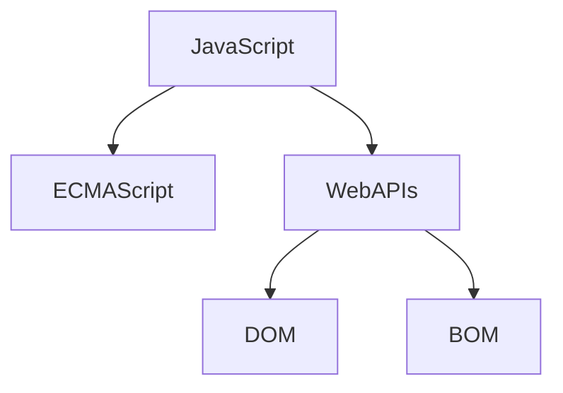
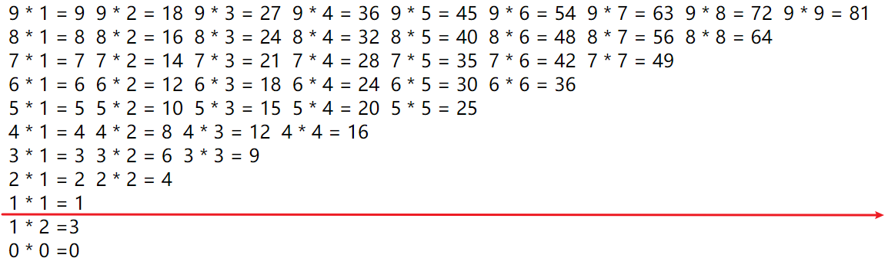
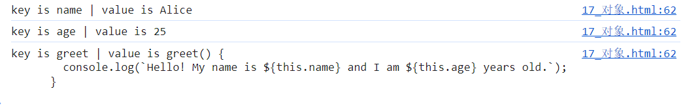
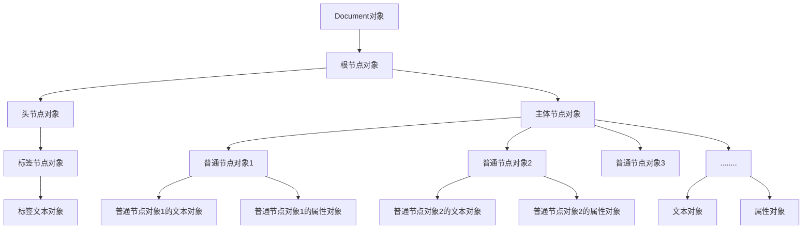
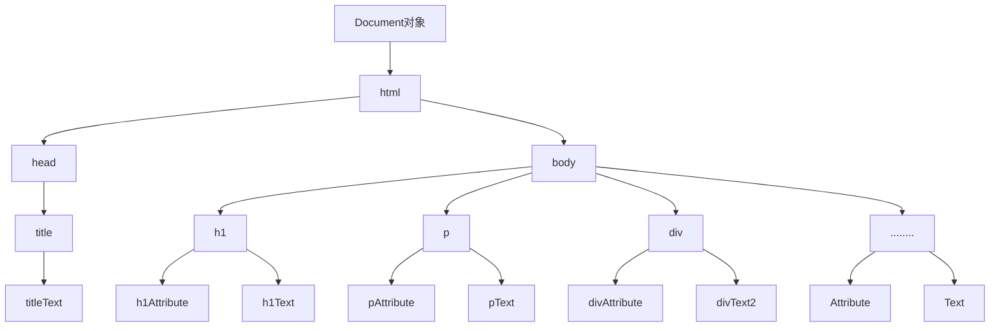
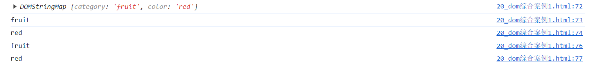
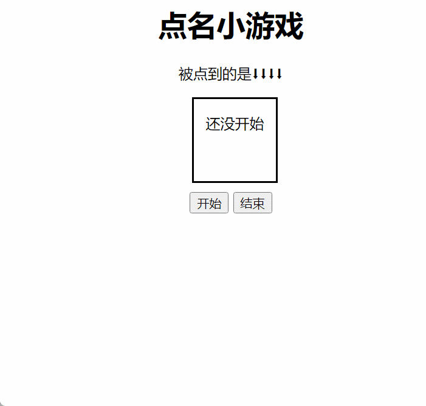

# JS基础

## 一、简介

### 1、js概述

> **tip：JavaScript是什么？ 有什么作用？**

JavaScript（简称JS）是一种轻量级的、解释性的编程语言，主要用于在网页上实现交互式的效果，比如验证表单输入、改变页面内容等。但随着技术的发展，JavaScript已经变得更加强大和多样化，能够实现复杂的任务和功能，包括：

1. **DOM 操作**：JavaScript 可以操作文档对象模型（DOM），使开发者能够动态地改变网页的结构和内容。
2. **事件处理**：通过监听用户的交互事件，比如点击、滚动、输入等，JavaScript可以触发相应的动作和功能。
3. **异步编程**：JavaScript 支持异步编程，通过回调函数、Promise 或者 async/await 等方式处理异步操作，比如网络请求、定时器等。
4. **前端框架**：出现了许多基于 JavaScript 的前端框架（比如React、Angular、Vue等），用于构建复杂的单页应用（SPA）和用户界面。
5. **服务器端开发**：Node.js 是一个基于 JavaScript 运行的服务器端环境，使得开发者能够使用 JavaScript 编写后端代码。

JavaScript 已经成为 web 开发中不可或缺的一部分，它的灵活性和功能丰富性使得开发者能够构建出各种各样交互丰富的网页和应用程序。

---

> **tip：JavaScript的组成有哪些？**

- **ECMAScript**：js的基础核心语法知识（变量、流程控制语句、对象、函数语法、箭头函数、模板字符串、Promise 等）
- **Web APIs**：
  - **DOM**（页面文档对象模型）：
    - 用于操作文档，提供了访问和操作网页内容的方法和接口。
    - 它以树形结构表示文档，允许开发者使用 JavaScript 添加、删除、修改网页的元素和内容，实现动态交互效果。
  - **BOM**（浏览器对象模型）：
    - 用于操作浏览器，BOM 提供了与浏览器窗口交互的方法和接口。
    - 它包括了操作浏览器窗口大小、处理浏览器历史记录、跟踪用户会话信息（比如 Cookie 和 Storage）、发起网络请求等功能。



---

> demo：dom交互效果，对网页的元素和内容进行CRUD


```html
<!DOCTYPE html>
<html lang="en">
<head>
  <meta charset="UTF-8">
  <meta name="viewport" content="width=device-width, initial-scale=1.0">
  <title>按钮变色</title>
</head>
<style>
  .c_pink {
    background-color: pink;
  }
</style>
<body>
  <button class="c_pink">按钮1</button>
  <button>按钮2</button>
  <button>按钮3</button>
  <button>按钮4</button>

  <!-- js -->
  <script>
    let bts = document.querySelectorAll('button')
    for (let i = 0; i < bts.length; i++) {
      bts[i].addEventListener('click', function () {
        document.querySelector('.c_pink').className = ''
        this.className = 'c_pink'
      })
    }
  </script>
</body>
</html>
```

---

> JS的书写位置：

JavaScript 可以在 HTML 文档中的不同位置书写：内联式、内部式、外部式

```html
<!DOCTYPE html>
<html>

<head>
  <title>JavaScript Example</title>
  <!-- 1.外部式:js代码也可以保存在外部文件中，并通过 `<script>` 标签的 `src` 属性引用。
    这种方式使得代码更易于维护和管理，并可以被多个页面共享 -->
  <script src="path/to/your/script.js"></script>

  <!-- 2.内部式:js代码也可以放置在 HTML 文件的 `<script>` 标签内部。
    这些 `<script>` 标签可以放在 `<head>` 或 `<body>` 中
 -->
  <script>
    // 可以在这里放置JavaScript代码
  </script>
</head>

<body>
  <!-- 3.内联式:js代码可以直接嵌入在 HTML 元素的事件属性中，比如在 onclick、onmouseover 等事件中
 -->
  <button onclick="alert('Hello!')">Click me</button>


  <script>
    // 可以在这里放置JavaScript代码
  </script>
</body>

</html>
```

---

> JS注释：

```js
//这是单行注释
/**
这是多行注释
这是多行注释
**/
```


### 2、js输入输出

> **JS输入输出语法**：


```js
//1.输出：修改dom输出元素内容
document.write('<h1>我是JS我修改了dom，我是一级标题</h1>')
//弹窗输出
alert('页面弹出了警告框')
//控制台输出
console.log('按F12可以看到控制台输出的内容')

//2.输入
var ipt = prompt('请输入你的年龄')
```


### 3、js字面量

> **🤖chatgpt**：什么是JS的字面量？

JavaScript中的字面量是指直接表示固定值的符号表示法。它们是在代码中直接表示数据的方式，而不需要通过变量或计算来生成。JavaScript支持多种字面量，包括：

1. **字符串字面量：** 使用单引号（'）或双引号（"）括起来的文本值，例如：`'Hello, World!'`。
2. **数字字面量：** 直接表示数字的值，可以是整数或浮点数，例如：`42`或`3.14`。
3. **布尔值字面量：** 表示真（true）或假（false）的值，例如：`true`或`false`。
4. **对象字面量：** 表示创建新对象的方式，使用大括号（{}）括起来的键值对，例如：`{ name: 'John', age: 30 }`。
5. **数组字面量：** 表示创建新数组的方式，使用方括号（[]）括起来的值列表，例如：`[1, 2, 3, 4]`。
6. **正则表达式字面量：** 表示正则表达式模式，使用斜杠（/）括起来，例如：`/pattern/`。

字面量提供了一种直接在代码中表示数据的方式，使得代码更易读、更直观。


## 二、变量、常量和数据类型

> **🤖chatgpt**：什么是变量？什么是数据类型？

- 变量是程序中用来存储数据值的容器（命名空间）。它们允许程序员在代码中引用这些值，并随着程序的执行而改变。

- 每个变量都有一个名称（标识符）和一个与之关联的值，这个值可以是数字、字符串、对象、函数等各种类型的数据。

举个例子，你可以创建一个变量来存储一个人的年龄：

```javascript
let age = 30;
```

在这里，`age`是变量的名称，而`30`是它的值。变量名是在程序中引用值的标签，使得我们可以轻松地操作和使用这些值，而无需每次都重复输入具体的数值。

而数据类型是编程语言中用来分类不同类型数据的分类方式。常见的数据类型包括：

1. **数字（Number）：** 包括整数和浮点数。
   
2. **字符串（String）：** 由字符组成的文本，比如`"Hello, World!"`。

3. **布尔值（Boolean）：** 代表真（`true`）或假（`false`）的值。

4. **对象（Object）：** 包含键值对的集合，用于存储复杂的数据结构。

5. **数组（Array）：** 一组按序排列的值的集合。

6. **函数（Function）：** 可以被调用执行的代码块。

数据类型决定了数据可以进行的操作以及存储的方式。在很多编程语言中，还有更多复杂的数据类型或者可以自定义数据类型，这些类型能够更精确地表示程序中的数据。

### 1、变量

> 如何声明一个变量并赋值？

```js
//1.声明: 声明的符号let、var、const；变量的名字自定义，此次为name
let name
//2.赋值: 将右边的值赋值给左边的变量
name = 'redvelet'

//声明同时赋值
let age = 18
```

> 变量命名规范：

1. 不能使用关键字
2. **应以字母、下划线（_）或美元符号（$）开头，不能以数字开头。**
3. 严格区分大小写

> **🤖chatgpt**：var和let的区别？

在 JavaScript 中，`var` 和 `let` 都是用于声明变量的关键字，但它们之间有几个重要的区别：

1. **作用域：**
   - `var` 声明的变量存在函数作用域（function scope）。这意味着使用 `var` 声明的变量在函数内部是可见的，而在函数外部是全局可见的。
   - `let` 声明的变量存在块级作用域（block scope）。块级作用域意味着使用 `let` 声明的变量仅在其所在的块（大括号 `{}` 内）中可见。

2. **变量提升：**
   - 使用 `var` 声明的变量存在变量提升（hoisting）的特性。这意味着在作用域内的任何位置都可以访问变量的声明，但初始化的值会被提升至作用域顶部，未初始化时值为 `undefined`，也就是先使用后声明的情况。
   - 使用 `let` 声明的变量不会出现变量提升的情况。在使用 `let` 声明之前访问变量会导致 ReferenceError。

3. **重复声明：**
   - 使用 `var` 可以多次声明同一变量而不报错。这可能会引发意外的问题，因为变量可以被重复赋值。
   - 使用 `let` 在同一作用域内重复声明同一变量会引发语法错误。

示例：

```js
//1.可以访问但是undifined
console.log('nums is ' + num)
var num = 10

//2.变量提升，覆盖原来
for (let i = 0; i < 10; i++) {
    var num = i;
}
console.log('for num is ' + num)  //控制台输出:for num is 9

let num2 = 10;
for (let i = 0; i < 10; i++) {
    let num2 = i;
}
console.log('for num2 is ' + num2)  //控制台输出:for num is 10
```

---

> 存储多个相同类型的变量 - 数组：

```js
let redvelet = ['裴珠泫', '姜涩琪', "孙承完", "朴秀荣"]
console.log(redvelet)
```


---

```js
console.log('redvelet is ' + redvelet)  //控制台输出:redvelet is 裴珠泫,姜涩琪,孙承完,朴秀荣
//使用索引访问: 数组名[索引号]
console.log(redvelet[0])  //控制台输出:裴珠泫
console.log(redvelet[3])  //控制台输出:朴秀荣
```

---

```js
//数组的遍历
for (let i = 0; i < redvelet.length; i++) {
    console.log('redvelet[' + i + ']' + ':' + '索引:' + i + '/' + '内容:' + redvelet[i])
}
```


### 2、常量

> 什么是常量？

- 使用`const`修饰的变量就是常量，一旦赋值不可再改变，除非修改源代码

```js
const PI = 3.1415926;
console.log('PI is ' + PI)
PI = 3
console.log('PI is ' + PI) //控制台输出:Uncaught TypeError: Assignment to constant variable.at 5_常量.html: 14: 8
```


### 3、数据类型

> 数据类型分类：基本数据类型、引用数据类型

JavaScript有七种基本数据类型：

1. **数字（Number）**：整数或浮点数。例如：`42` 或 `3.14`。

2. **字符串（String）**：文本类型，使用单引号或双引号、反引号表示。例如：`'Hello, World!'`。

   - 模板字符串：

     ```js
     //模板字符串：反引号包裹+${}
     let age = 18
     console.log(`刚满${age}岁`)
     //例子
     let question = prompt('你好请问你今年多大?')
     document.write(`刚满${question}岁`)
     ```

3. **布尔值（Boolean）**：表示逻辑上的 true 或 false。

4. **空（Null）**：表示一个空值或不存在的值。例如：`null`。

5. **未定义（Undefined）**：表示声明了变量但未赋值的情况。例如：`undefined`。

6. **Symbol**：ES6 新增加的数据类型，表示独一无二的值。

7. **BigInt**：ES10 新增加的数据类型，用来表示更大范围的整数。

此外，JavaScript也有复杂数据类型：

1. **对象（Object）**：用于存储多个值的集合，键值对的集合。

2. **数组（Array）**：特殊类型的对象，按顺序存储多个值的列表。

这些数据类型在JavaScript中被广泛使用，不同的数据类型用于存储和操作不同种类的数据。

**数据类型检测**：typeof

```js
let num = 1.1
console.log(typeof num) //控制台输出number
let obj = null
console.log(typeof obj) //控制台输出object
let redvelet = ['xxx', 'xxxx']
console.log(typeof redvelet) //控制台输出object
```


> **🤖chatgpt**：JS是弱数据类型解释？

JavaScript被描述为一种弱类型或者动态类型的语言，这意味着在JavaScript中，变量的数据类型可以在运行时自动改变。弱类型语言相对于强类型语言而言，更容易隐式地转换变量的数据类型。

在强类型语言中，变量的数据类型是固定的，不同类型的数据需要明确的转换才能进行操作。但在JavaScript中，这种类型的转换通常是隐式的，例如：

```javascript
let x = '10' //x是一个字符串
let y = 5 //y是一个数字

let result = x + y //JavaScript隐式地将数字转换为字符串，结果是字符串'105'

//如果是强数据类型-java-一定义就要明确类型
int num = 10;
```

在上面的例子中，JavaScript隐式地将数字 `y` 转换为字符串类型，然后将两个字符串进行连接，而不是进行数学上的加法运算。这种隐式类型转换可以方便编码，但有时也可能导致意外的行为。

弱类型语言的特性让开发者需要更加小心地处理变量类型，确保在操作数据时不会因为隐式的类型转换而引发错误。这也是JavaScript灵活性和易用性的一部分，但也需要谨慎使用以避免潜在的问题。


> **🤖chatgpt**：js的算术运算符和执行的优先级顺序

JavaScript中的算术运算符用于执行数学运算。**优先级越高约先被执行，优先级相同从左往右**，以下是一些常见运算符的优先级顺序（从高到低）：

1. **括号：** `()`（括号内的表达式优先计算）
2. **指数运算：** `**`（ES7 新增的指数运算符，计算一个数的指数）
3. **乘法、除法和求余运算：** `*`、`/`、`%`（取模运算，返回除法操作的余数）
4. **加法和减法运算：** `+`（用于加法运算或字符串拼接）、`-`

示例：

```javascript
let result = 10 + 5 * 2; // 先乘法后加法，result 等于 20，因为乘法优先级高于加法
```

如果有相同优先级的运算符，运算顺序是从左到右。但是可以使用括号来明确运算顺序，确保表达式按照预期进行计算。

```javascript
let result = (10 + 5) * 2; // 括号优先，result 等于 30，先执行括号内的加法
```

理解运算符的优先级和结合性对于正确编写复杂的表达式非常重要，这可以避免因为运算次序错误而导致意外的结果。


> **tip：数据类型转换**：JS是弱数据类型，JS只有赋值了才知道是什么数据类型，且使用prompt和表单获取的数据默认是字符串类型，如果相加那么就是拼接，而不是相加。

**隐式类型转换：**


```js
//+号单个使用可以使字符串转化为数字类型
//+号和字符串匹配使用，效果是拼接
//- * /等不同与+号，它们的效果是转换
let num1 = prompt('请输入一个数字1:') //输入:22
let num2 = prompt('请输入一个数字2:') //输入:22
console.log(`${num1}+${num2} = ` + ((+num1) + (+num2))) //控制台输出:44
console.log(`${num1}+${num2} = ` + ((+num1) + (num2)))  //控制台输出:2222
console.log(`${num1}+${num2} = ` + ((num1) + (num2)))  //控制台输出:2222
console.log(`${num1}-${num2} = ` + ((num1) - (num2)))  //控制台输出:0
```

---

**显式类型转换：**数据类型(变量)、parseInt(变量)、parseFloat(变量)


```js
let num10 = '12000.001'
console.log(typeof num10)  //控制台输出:0
console.log(typeof +num10)  //控制台输出:0
console.log(typeof Number(num10))  //控制台输出:0
console.log(Number(num10))  //控制台输出:12000.001
console.log(parseInt(num10))  //控制台输出:12000
console.log(parseFloat(num10))  //控制台输出:12000.001
```


## 三、流程控制、循环语句和数组

### 1、流程控制语句

```js
if(xxxx){

}else{

}
let key = 'xxx'
switch(key){
    case '1':
        xxxx
        break
    case '2':
        xxxx
        break
    default:
        break
}
```


### 2、循环语句

> 循环语句：就是重复执行某些操作（具体的代码）

- 循环三要素：循环起始条件、终止条件、变量变化量
- break：推出当前循环
- continue：跳过当前循环

```js
//while循环
//1.循环起始站
let count = 5;
//2.循环终止条件
while (count > 0) {
    if (count === 4) {//跳过4
        count--
        continue
    }
    if (count === 1) {//为1的时候直接退出
        break
    }
    document.write(`count is ${count} &nbsp;`)
    //3.循环变量变化量
    count--
}

//for循环
for (let i = 0; i < 10; i++) {
    document.write(`49年入国军 ${i} &nbsp;`)
}
```


### 3、数组

> 数组的CRUD操作：

- **定义数组**：`let 数组名 = [] / let 数组名 = {内容…..}`
- **添加元素**：返回新增后的长度
  - push()：头插
  - unshift()：尾插
- **删除元素**：返回删除的内容
  - shift()：头删
  - pop()：尾删
  - splice(, )：删除指定区间（左闭右闭）

```js
//1.新增 push unshift - 返回新增后的长度
let redvelet = []
console.log(redvelet.push('裴珠泫'))//尾插
console.log(redvelet.push('裴珠泫', '姜涩琪', '孙承完'))//尾插
console.log(redvelet.unshift('irene'))//头插
console.log(redvelet)

//2.删除 shift splice - 返回删除的内容
console.log(redvelet.shift())//头删
console.log(redvelet.pop())//尾删
console.log(redvelet.splice(0, 2))//删除指定区间，左闭右闭
console.log(redvelet)
```


## 四、函数和对象

### 1、函数概述

> **🤖chatgpt**：什么是函数？为什么要有函数？

函数是一种可重复使用的代码块，它们可以接受输入（参数）、执行特定的任务，并返回结果。

JavaScript中函数是非常重要的概念，有几个关键的原因：

1. **重用性**：函数允许您编写一次代码，并可以多次调用。这样可以避免重复编写相同的代码块，提高代码的重用性和可维护性。

2. **模块化**：函数可以将代码划分为小的、独立的模块。这有助于提高代码的可读性和组织性，并使得整个程序更易于管理和理解。

3. **抽象和封装**：通过函数，您可以将复杂的操作抽象为单个操作，这有助于隐藏内部实现细节。这种抽象和封装使代码更易于理解和使用。

4. **参数传递**：函数可以接受参数作为输入，并返回结果作为输出。这样可以将数据传递给函数进行处理，从而使得代码更加灵活和可定制。

5. **代码组织**：函数可以将代码组织成可管理的单元，有助于将大型问题分解为更小的、易于处理的部分。这样可以更有效地开发和维护代码。

总的来说，函数是编程中的基本构建块之一，可以使代码更加灵活、模块化、可维护，并且提高了代码的可读性和可重用性。


> 函数的定义：

```js
function functionName(parameters) {
  // 函数体（代码块），执行特定任务
  // 可以使用传入的参数进行操作
  return result; // 返回结果（可选）
}
```

这里有几个要点：

- **函数名**：用来标识函数的名称，可以通过它来调用函数。
- **参数**：函数可以接受零个或多个参数，这些参数是函数在执行时所需要的输入。
- **函数体**：包含在花括号内的代码块，它定义了函数执行的任务和操作。
  - **函数体内的变量如果没有使用let声明，会使变量提升，变成全局变量**


> 1.创建函数，打印10个倒三角99乘法表
>
> 2.创建函数，计算两数之和

```js
function get99() {
    for (let i = 9; i > 0; i--) {
        for (let j = 1; j <= i; j++) {
            document.write(`${i} * ${j} = ${i * j} &nbsp;`)
        }
        document.write(`</br>`)
    }
}
for (let i = 0; i < 1; i++) {
    get99();
    document.write(`</hr>`)
}
function getSum(x = 0, y = 0) { //不传参数，默认为0
    document.write(`${x} * ${y} =${x + y}</br>`)
}
//------------------------------------------------------------------------------------------
getSum(1, 2)
getSum()  //不传参数，默认为0
```




### 2、匿名函数和立即执行函数

> **🤖chatgpt**：什么是匿名函数？ 如何定义和使用匿名函数？

JavaScript中的匿名函数是指没有名称的函数，它们可以在需要时被直接定义和使用，而无需在代码中命名。通常，匿名函数被用作函数表达式，这些表达式可以赋值给变量，作为另一个函数的参数，或在需要函数时直接调用。

这是一个匿名函数的例子：

```javascript
let myFunction = function() {
  console.log("这是一个匿名函数。");
};

// 调用匿名函数
myFunction();
```

在这个例子中，`myFunction` 被赋值为一个匿名函数，它没有函数名，但是可以通过 `myFunction()` 调用。

匿名函数经常用在需要一次性使用的地方，比如作为另一个函数的参数：

```javascript
setTimeout(function() {
  console.log("一秒钟后执行此匿名函数。");
}, 1000);
```

在这个例子中，`setTimeout` 函数接受一个函数作为第一个参数，这个函数在定时器到期后被执行。这个函数是一个匿名函数，它被直接传递给 `setTimeout` 而不需要定义一个单独的函数。

匿名函数在一些情况下可以带来方便，尤其是在只需临时使用一个函数时，可以避免为函数赋予命名。


> **🤖chatgpt**：什么是立即执行函数？ 如何定义和使用立即执行函数？

立即执行函数（Immediately Invoked Function Expression，IIFE）是JavaScript中的一种常见模式，用于创建并立即执行函数。

它的基本结构是将一个函数定义包裹在圆括号内，然后在其后再加上另一对圆括号用于立即调用该函数，就像这样：

```javascript
(function() {
  // 在这里编写代码，这个函数会立即执行
})();
```

这个模式中的函数是一个匿名函数，它被定义后立即以表达式的方式调用。这样做的好处之一是可以创建一个独立的作用域，避免变量污染全局作用域。

另外，IIFE 也可以传递参数：

```javascript
(function(name) {
  console.log("欢迎, " + name);
})("Alice");
```

==这个例子中的函数立即被调用，并将字符串 "Alice" 作为参数传递给这个函数。==

IIFE 在一些情况下非常有用，特别是在需要创建私有作用域或者避免污染全局命名空间的情况下。


### 3、对象

> **🤖chatgpt**：什么是对象？ 如何定义和使用对象？

在 JavaScript 中，对象是一个包含键值对的数据结构。键是字符串（或符号），值可以是任何数据类型，包括其他对象。对象可以用来表示复杂的数据结构，它允许您组织和访问相关数据。

对象可以通过不同的方式定义：

1. **对象字面量**：这是定义对象最常见和简单的方式。对象字面量使用大括号 `{}`，其中包含零个或多个键值对。

   ```javascript
   let person = {
     name: 'John',
     age: 30,
     city: 'New York'
   };
   ```

2. **使用构造函数**：可以使用内置的构造函数（例如 `Object`）来创建对象。

   ```javascript
   let person = new Object();
   person.name = 'John';
   person.age = 30;
   person.city = 'New York';
   ```

3. **使用类**：在 ES6 中引入了类的概念，通过 `class` 关键字可以定义对象的蓝图。

   ```javascript
   class Person {
     constructor(name, age, city) {
       this.name = name;
       this.age = age;
       this.city = city;
     }
   }
   
   let person = new Person('John', 30, 'New York');
   ```

对象可以包含各种类型的数据，包括其他对象、数组、函数等。可以通过点号（`.`）或者中括号（`[]`）语法来访问对象的属性。

例如，访问对象属性的方式可以是：

```javascript
console.log(person.name); // 使用点号访问属性
console.log(person['age']); // 使用中括号访问属性
```

这些方法都会输出对象 `person` 的属性值。对象是 JavaScript 中非常重要的数据类型之一，它们允许您以一种灵活和组织良好的方式存储和操作数据。


> **🤖chatgpt**：对象中的方法？

对象方法是指附加到对象的函数。它们允许对象执行特定的操作或者执行一些功能。在 JavaScript 中，对象的方法是对象属性的一种形式，它的值是一个函数。

定义对象方法的示例：

```javascript
let person = {
  name: 'Alice',
  age: 25,
  greet: function() {
    console.log('Hello! My name is ' + this.name + ' and I am ' + this.age + ' years old.');
  }
};

// 调用对象方法
person.greet(); // 输出: Hello! My name is Alice and I am 25 years old.
```

在这个例子中，`greet` 是 `person` 对象的方法，它是一个函数。当调用 `person.greet()` 时，函数会执行，并且可以访问该对象的属性（例如 `name` 和 `age`）。

对象方法可以访问对象自身的属性和其他方法，通常使用关键字 `this` 来引用对象的当前实例。这样可以在方法内部访问和操作对象的属性。

除了上述的方法定义方式之外，在 ES6 中引入了更简洁的方法定义语法：

```javascript
let person = {
  name: 'Alice',
  age: 25,
  greet() {
    console.log(`Hello! My name is ${this.name} and I am ${this.age} years old.`);
  }
};

person.greet(); // 输出: Hello! My name is Alice and I am 25 years old.
```

这种语法更加简洁，但本质上与上面的示例相同。对象方法是组织代码和实现对象行为的重要方式，在 JavaScript 中常常用于操作和处理对象数据。


> ==对象的遍历：==

```js
let person = {
    name: 'Alice',
    age: 25,
    greet() {
        console.log(`Hello! My name is ${this.name} and I am ${this.age} years old.`);
    }
};
//对象的遍历
for (key in person) {
    console.log(`key is ${key} | value is ${person[key]}`)
}
```




> **🤖chatgpt**：JS内置对象是什么？ 有哪些？ 常用用法？

JavaScript 中的内置对象是指在语言核心中定义的对象，这些对象可以直接在代码中使用，无需进行特殊的声明或者引入。这些内置对象提供了很多常用的方法和功能，可以用于各种目的，包括数据处理、字符串操作、日期处理、数学计算等。

当谈到 JavaScript 的内置对象时，它们可以根据其功能分为不同的类别。以下是其中一些常见类别及其一些代表性对象：

1. **基本对象**

   - **Object**：JavaScript 中所有对象的基础。提供创建对象、设置属性等功能。
     
       ```javascript
       let person = { name: 'John', age: 30 };
       Object.keys(person); // 获取对象的键列表
       ```
       
       - **Array**：用于操作和处理数组，提供了添加、删除、排序、遍历等一系列方法。
       
       ```javascript
       let numbers = [1, 2, 3];
       numbers.push(4); // 在末尾添加元素
       numbers.pop(); // 移除末尾元素
       ```
       


2. **文本处理对象**

   - **String**：用于操作和处理字符串，提供了获取长度、分割、连接、大小写转换等方法。
     
       ```javascript
       let greeting = 'Hello, World!';
       greeting.length; // 字符串长度
       greeting.toUpperCase(); // 转换为大写
       ```


3. **数字和日期对象**

   - **Number**：用于处理数字，提供了数值转换、数学运算等方法。
     
       ```javascript
       let num = 10;
       num.toFixed(2); // 保留两位小数
       ```
       
       - **Date**：用于处理日期和时间。
       
       ```javascript
       let currentDate = new Date();
       currentDate.getFullYear(); // 获取年份
       ```
       


4. **其他常用对象**

   - **Math**：提供数学计算相关的方法，如三角函数、对数、随机数生成等。
     
       ```javascript
       Math.max(5, 10, 20); // 返回最大值
       Math.random(); // 返回一个 [0, 1) 之间的随机数
       ```
       
   - **RegExp**：用于处理正则表达式，提供了搜索、替换、匹配等方法。
     
       ```javascript
       let pattern = /test/g;
       pattern.test('test'); // 检测字符串中是否包含匹配
       ```


这些内置对象提供了丰富的功能和方法，用于处理数据、字符串、日期、数学计算、正则表达式等各种常见操作。可以根据具体的需求来选择并使用这些对象的方法来实现相应的功能。


## 五、Web APIs

### 1、DOM

> DOM用于操作网页的结构：dom用于操作html的每个标签，可以对标签进行crud，以及对标签的内容进行crud，还能为其添加对应的动作。具体可以理解为html的标签 —> js里面的dom对象



---




> **🤖chatgpt**：什么是document：

在 JavaScript 中，`document` 是代表整个 HTML 文档的对象。它是 DOM（文档对象模型）的一部分，提供了访问和操作网页内容的接口。通过 `document` 对象，你可以访问整个 HTML 文档的各个部分，比如 HTML 元素、样式、事件等等。

一些常见的 `document` 对象的属性和方法包括：

- `document.getElementById()`：通过元素的 id 获取对应的 HTML 元素。
- `document.querySelector()` 和 `document.querySelectorAll()`：通过 CSS 选择器来选择元素。
- `document.createElement()`：创建新的 HTML 元素。
- `document.createTextNode()`：创建包含指定文本的新文本节点。
- `document.body`：引用文档的 `<body>` 元素。
- `document.head`：引用文档的 `<head>` 元素。

举个例子，如果你想通过 JavaScript 改变页面上某个元素的内容或样式，你可以使用 `document` 对象来获取该元素，然后进行相应的操作。例如：

```javascript
// 获取id为"myElement"的元素
const element = document.getElementById('myElement');

// 改变文本内容
element.textContent = '新的文本内容';

// 改变样式
element.style.color = 'red';
```

`document` 对象是 JavaScript 中非常重要的一个部分，它让你可以动态地操作和控制整个网页的内容和结构。


#### 1.1 获取DOM对象

**在 JavaScript 中，你可以使用不同的方法来获取 DOM 对象（标签元素）。这些方法可以帮助你通过 JavaScript 来操作和修改 HTML 元素。以下是一些常用的方法**：

##### （1）通过 ID 获取元素

> 通过元素的 ID 属性可以获取对应的 DOM 对象：

```javascript
const element = document.getElementById('elementId');
```

##### （2）通过类名获取元素

> 通过类名可以获取一个或多个元素：

```javascript
// 获取第一个类名为 className 的元素
const element = document.querySelector('.className');

// 获取所有类名为 className 的元素（返回 NodeList）
const elements = document.querySelectorAll('.className');
```

##### （3）通过标签名获取元素

> 通过标签名可以获取一个或多个特定标签的元素：

```javascript
// 获取第一个 <div> 元素
const element = document.querySelector('div');

// 获取所有 <div> 元素（返回 NodeList）
const elements = document.querySelectorAll('div');

// 获取所有 <ul>下的所有<li> 元素（返回 NodeList）
const elements = document.querySelectorAll('ul li');
```

##### （4）获取父级、子级、兄弟元素

```javascript
// 获取父级元素
const parentElement = element.parentNode;

// 获取子级元素
const childElements = element.childNodes; // 注意这会包括文本节点等

// 获取第一个子元素
const firstChild = element.firstChild;

// 获取最后一个子元素
const lastChild = element.lastChild;

// 获取下一个兄弟元素
const nextElement = element.nextElementSibling;

// 获取上一个兄弟元素
const prevElement = element.previousElementSibling;
```

这些方法可以帮助你根据需要选择并获取所需的 DOM 元素，从而在 JavaScript 中对其进行操作和修改。


#### 1.2 操作DOM对象

##### （1）操作对象内容

- `innerText` 可以用来获取或设置元素内的纯文本内容。
- `textContent` 可以用来获取或设置元素内的纯文本内容。
- `innerHTML` 可以用来获取或设置元素内部的 HTML 内容。

```js
const pzx = document.querySelector('#pzx')
pzx.innerText = '<b>irene</b>'
pzx.innerHTML = '<b>irene</b>'
pzx.textContent = '<b>irene</b>'
```


##### （2）操作对象属性

###### a. 操作普通属性：

- **getAttribute 和 setAttribute：**
  - `getAttribute` 用于获取元素的属性值。
  - `setAttribute` 用于设置元素的属性值。

示例：

```javascript
// 获取元素的属性值
var linkHref = document.getElementById('myLink').getAttribute('href');

// 设置元素的属性值
document.getElementById('myLink').setAttribute('href', 'https://example.com');
```

###### b. 操作样式属性：

- **style 属性：**
  - `style` 属性可以直接访问和修改元素的样式。

示例：

```javascript
// 修改元素的样式
document.getElementById('myElement').style.backgroundColor = 'blue';
document.getElementById('myElement').style.fontSize = '20px';
```

这些方法和属性能够帮助你在 JavaScript 中操作 DOM 对象的内容和属性，从而动态地改变网页的外观和行为。

- **classList操作类控制css**：

  - ```css
    .active1 {
        border: 1px solid black;
    }
    .active2 {
        border: 3px solid red;
    }
    ```

    

  - ```js
    pzx.classList.add('active1')//添加类
    pzx.classList.remove('active1')//删除类
    pzx.classList.toggle('active2')//切换类
    ```

###### c.自定义属性：

自定义属性是指在 HTML 元素中添加非标准的自定义属性，这些属性不会影响元素的默认行为，但可以用来存储自定义的信息或标记。通常，自定义属性的命名遵循 `data-*` 的约定，其中 `*` 可以是任何描述性的名称。

> 在 HTML 中添加自定义属性：

```html
<!DOCTYPE html>
<html>
<head>
  <title>自定义属性示例</title>
</head>
<body>
  <div id="myDiv" data-category="fruit" data-color="red">
    这是一个带有自定义属性的 div 元素。
  </div>
</body>
</html>
```

在这个例子中，`<div>` 元素有两个自定义属性：`data-category` 和 `data-color`。这些属性可以存储任意自定义数据，比如此例中的分类信息和颜色信息。

> 在 JavaScript 中获取自定义属性值：

```javascript
// 获取元素
const myDiv = document.getElementById('myDiv')

//dataset获取自定义属性值
const dataSet = myDiv.dataset;
console.log(dataSet)
console.log(dataSet.category)
console.log(dataSet.color)

//getAttribute获取自定义属性值
let category = myDiv.getAttribute('data-category');
let color = myDiv.getAttribute('data-color');

// 输出自定义属性值
console.log(category); // 输出：fruit
console.log(color);    // 输出：red
```

1. 跳过dataset方式获取
2. 通过使用 `getAttribute()` 方法，你可以在 JavaScript 中获取自定义属性的值。使用 `data-` 前缀的自定义属性可以很方便地存储和检索信息，这对于在 HTML 元素中添加自定义数据或标记非常有用。




#### 1.3 定时器

JavaScript 中的定时器允许你在指定的时间间隔后执行代码。有两种常用的定时器：`setTimeout` 和 `setInterval`。

##### setTimeout

> `setTimeout` 用于在指定的毫秒数之后执行一次特定的代码。

```javascript
// 在 2000 毫秒（2秒）后执行一次特定的代码
setTimeout(function() {
  // 这里是要执行的代码
  console.log('2秒后执行这里的代码');
}, 2000);
```

##### setInterval

> `setInterval` 用于每隔一定的毫秒数重复执行特定的代码。

```javascript
// 每隔 1000 毫秒（1秒）重复执行一次特定的代码
let interval = setInterval(function() {
  // 这里是要重复执行的代码
  console.log('每隔1秒执行一次');
}, 1000);
```

##### 清除定时器

> 无论是 `setTimeout` 还是 `setInterval`，都可以通过 `clearTimeout` 或 `clearInterval` 来取消定时器的执行。

```javascript
// 取消 setTimeout
let timeout = setTimeout(function() {
  // 代码内容
}, 2000);

clearTimeout(timeout); // 取消该定时器的执行

// 取消 setInterval
let interval = setInterval(function() {
  // 代码内容
}, 1000);

clearInterval(interval); // 取消该定时器的执行
```

这些定时器函数可以帮助你在 JavaScript 中控制代码的执行时间，是实现延迟执行和周期性执行任务的常用方法。

---

> **倒计时例子：**

- html：

  ```html
  <h2>倒计时<span class="myTime">5</span>秒</h2>
  ```

- js：

  ```js
  const myTime = document.querySelector('.myTime')
  let count = +myTime.textContent;
  let timeOut = function () {
      let nowNumber = +myTime.textContent
      nowNumber--
      myTime.textContent = nowNumber
  }
  let myInterval = setInterval(function () {
      if (count == 0) {
          clearInterval(timeOut)
      } else {
          timeOut()
          count--
      }
  }, 1000);
  ```

- 效果：


---

> 定时轮播：

- 相对目录下创建文件夹images存放4张图片

```html
<!DOCTYPE html>
<html lang="en">

<head>
  <meta charset="UTF-8">
  <meta name="viewport" content="width=device-width, initial-scale=1.0">
  <title>21_dom综合案例2.html</title>
</head>
<style>
  img {
    max-width: 30%;
    /* 图片最大宽度为父元素宽度 */
    height: auto;
    /* 高度自动调整，保持宽高比 */
    border: 1px solid rgb(216, 88, 88);
  }
</style>

<body>
  <div id="box">
    <p class="imgUrl"></p>
    
  </div>
  <script>
    document.querySelector('.imgUrl').textContent = document.querySelector('img').src
    let lbt = function (imgNum = 4) {
      const myImg = document.querySelector('img')
      const imgUrl = document.querySelector('.imgUrl')
      let imgSource = myImg.src
      let newArr = imgSource.split('/')
      let suffix = newArr[newArr.length - 1]

      let nowImgArr = suffix.split('.')
      let nowImg = nowImgArr[0]
      if (+nowImg == imgNum) {
        nowImg = 0
      }
      nowImg++
      let path = './images/' + nowImg + '.' + nowImgArr[1];
      myImg.src = path
      imgUrl.textContent = path
    }
    let lbtTimer = setInterval(function () {
      lbt()
    }, 2000)
  </script>
</body>
</html>
```


#### 1.4 事件监听

事件监听是一种编程模式，允许 JavaScript 代码侦听（或监听）特定事件的发生，并在事件发生时执行预定义的操作或函数。

- 事件：**用户操作（比如点击鼠标、按下键盘按键等）、页面加载完成、网络请求完成等等**。
- 当特定的事件发生时，你可以使用事件监听器来捕获这些事件并执行相应的 JavaScript 代码。

> 事件监听的基本结构：

1. 添加事件监听器：你可以使用 `addEventListener` 方法来添加事件监听器，语法通常是：

```javascript
element.addEventListener(event, function, useCapture);
```

- `event` 是要监听的事件名称，比如 `"click"`（鼠标点击事件）或 `"keyup"`（键盘松开事件）等。
- `function` 是当事件发生时执行的函数或代码块。
- `useCapture` 是一个可选的布尔值参数，用于指定事件是在捕获阶段（`true`）还是冒泡阶段（`false`）触发，默认为 `false`（冒泡阶段）。

2. 事件触发时执行相应函数：当指定的事件发生时，添加的函数会被触发执行。

> 示例：



- HTML：

```html
<h1 style=" text-align: center;">点名小游戏</h1>
<p style=" text-align: center;">被点到的是⬇⬇⬇⬇</p>
<div style="border: 2px solid black; width: 90px;height: 90px;margin-left:47% ;">
    <p style=" text-align: center;">
        <span id="result">还没开始</span>
    </p>
</div>
<div style=" text-align: center; margin-top: 10px">
    <button id="startButton">开始</button>
    <button id="stopButton">结束</button>
</div>
```

- JavaScript：

```javascript
let names = ['周杰伦', '张学友', '郭富城', '刘德华', '黎明', '王力宏', '谢霆锋']
let switchName = function () {//切换名字
    const result = document.querySelector('#result')
    let randonIndex = Math.floor(Math.random() * names.length)
    result.textContent = names[randonIndex]
}
let printName = function () {//输出结果
    const result = document.querySelector('#result')
    const bd = document.querySelector('body')
    const newChild = document.createElement('p')
    newChild.style.textAlign = 'center'
    newChild.textContent = '点名结果:' + result.textContent
    bd.appendChild(newChild)
}
let startButton = document.querySelector('#startButton')
let swhTimer
startButton.addEventListener('click', function () {
    swhTimer = setInterval(function () {//定时调用
        switchName()
    }, 50)

})

let stopButton = document.querySelector('#stopButton')
stopButton.addEventListener('click', function () {
    clearInterval(swhTimer)
    printName()
})
```

这个示例中，当按钮被点击时，`addEventListener` 将捕获到点击事件，并执行匿名函数，弹出一个警告框。

事件监听器是一种非常强大和常用的技术，可以让你编写交互式的 JavaScript 代码，根据用户的操作或其他事件来执行相应的功能。


#### 1.5 this和回调函数

- 在 JavaScript 中，回调函数是**作为参数传递给其他函数的函数**，它在某些条件满足时被调用执行。
- `this` 关键字在 JavaScript 中用于指代当前执行上下文的对象，就是**谁调用的this就是谁**。

###### this 关键字：

`this` 关键字在 JavaScript 中是一个特殊的关键字，它指代当前函数执行的上下文对象。`this` 的值在不同的情况下可能会有所不同。

```javascript
var obj = {
  name: 'John',
  greet: function() {
    console.log('Hello, ' + this.name);
  }
};

obj.greet(); // 输出: Hello, John
```

在这个例子中，`this` 在 `greet` 函数内部指代了包含 `greet` 函数的对象 `obj`，因此 `this.name` 访问了 `obj` 对象中的 `name` 属性。

然而，在 JavaScript 中，`this` 的值可能会因执行上下文的不同而有所不同，比如在全局上下文、函数内部、事件处理程序等等。这是 JavaScript 中一个相对复杂且容易引起混淆的概念，`this` 的指向可能需要根据具体情况加以了解和处理。

###### 回调函数：

回调函数是一种常见的编程模式，特别是在处理异步操作时。它允许你将一个函数作为参数传递给另一个函数，以便在某些事件发生或操作完成后执行这个函数。

```javascript
function doSomethingAsync(callback) {
  // 模拟异步操作
  setTimeout(function() {
    callback();
  }, 1000);
}

function callbackFunction() {
  console.log('回调函数被执行了！');
}

// 调用函数并传递回调函数作为参数
doSomethingAsync(callbackFunction);
```

在这个例子中，`doSomethingAsync` 函数模拟一个异步操作（使用 `setTimeout` 模拟延迟），并在操作完成后执行传递的回调函数 `callback`。

