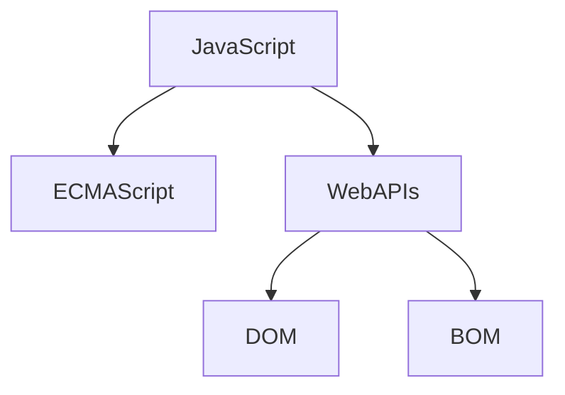
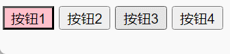
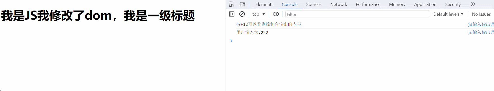
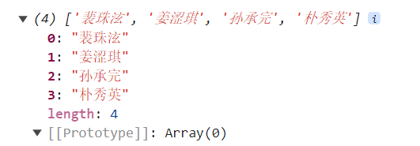
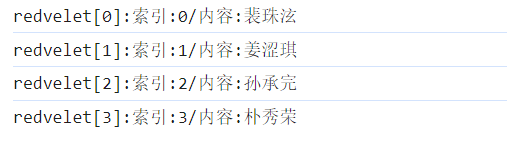
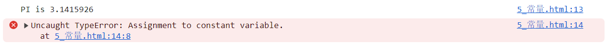
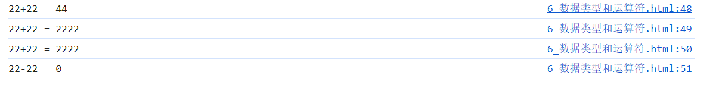
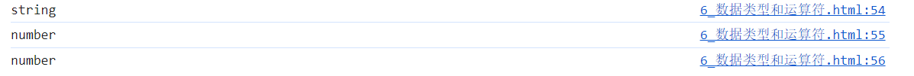
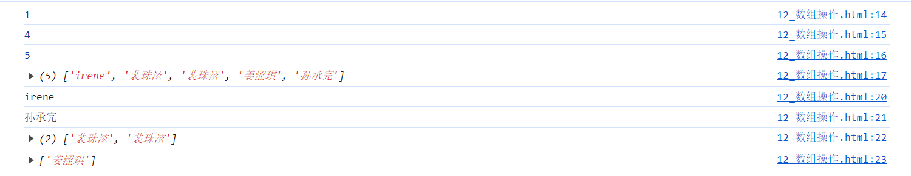

# JS基础

## 一、简介

### 1、js概述

> **tip：JavaScript是什么？ 有什么作用？**

JavaScript（简称JS）是一种轻量级的、解释性的编程语言，主要用于在网页上实现交互式的效果，比如验证表单输入、改变页面内容等。但随着技术的发展，JavaScript已经变得更加强大和多样化，能够实现复杂的任务和功能，包括：

1. **DOM 操作**：JavaScript 可以操作文档对象模型（DOM），使开发者能够动态地改变网页的结构和内容。
2. **事件处理**：通过监听用户的交互事件，比如点击、滚动、输入等，JavaScript可以触发相应的动作和功能。
3. **异步编程**：JavaScript 支持异步编程，通过回调函数、Promise 或者 async/await 等方式处理异步操作，比如网络请求、定时器等。
4. **前端框架**：出现了许多基于 JavaScript 的前端框架（比如React、Angular、Vue等），用于构建复杂的单页应用（SPA）和用户界面。
5. **服务器端开发**：Node.js 是一个基于 JavaScript 运行的服务器端环境，使得开发者能够使用 JavaScript 编写后端代码。

JavaScript 已经成为 web 开发中不可或缺的一部分，它的灵活性和功能丰富性使得开发者能够构建出各种各样交互丰富的网页和应用程序。

---

> **tip：JavaScript的组成有哪些？**

- **ECMAScript**：js的基础核心语法知识（变量、流程控制语句、对象、函数语法、箭头函数、模板字符串、Promise 等）
- **Web APIs**：
  - **DOM**（页面文档对象模型）：
    - 用于操作文档，提供了访问和操作网页内容的方法和接口。
    - 它以树形结构表示文档，允许开发者使用 JavaScript 添加、删除、修改网页的元素和内容，实现动态交互效果。
  - **BOM**（浏览器对象模型）：
    - 用于操作浏览器，BOM 提供了与浏览器窗口交互的方法和接口。
    - 它包括了操作浏览器窗口大小、处理浏览器历史记录、跟踪用户会话信息（比如 Cookie 和 Storage）、发起网络请求等功能。



---

> demo：dom交互效果，对网页的元素和内容进行CRUD



```html
<!DOCTYPE html>
<html lang="en">
<head>
  <meta charset="UTF-8">
  <meta name="viewport" content="width=device-width, initial-scale=1.0">
  <title>按钮变色</title>
</head>
<style>
  .c_pink {
    background-color: pink;
  }
</style>
<body>
  <button class="c_pink">按钮1</button>
  <button>按钮2</button>
  <button>按钮3</button>
  <button>按钮4</button>

  <!-- js -->
  <script>
    let bts = document.querySelectorAll('button')
    for (let i = 0; i < bts.length; i++) {
      bts[i].addEventListener('click', function () {
        document.querySelector('.c_pink').className = ''
        this.className = 'c_pink'
      })
    }
  </script>
</body>
</html>
```

---

> JS的书写位置：

JavaScript 可以在 HTML 文档中的不同位置书写：内联式、内部式、外部式

```html
<!DOCTYPE html>
<html>

<head>
  <title>JavaScript Example</title>
  <!-- 1.外部式:js代码也可以保存在外部文件中，并通过 `<script>` 标签的 `src` 属性引用。
    这种方式使得代码更易于维护和管理，并可以被多个页面共享 -->
  <script src="path/to/your/script.js"></script>

  <!-- 2.内部式:js代码也可以放置在 HTML 文件的 `<script>` 标签内部。
    这些 `<script>` 标签可以放在 `<head>` 或 `<body>` 中
 -->
  <script>
    // 可以在这里放置JavaScript代码
  </script>
</head>

<body>
  <!-- 3.内联式:js代码可以直接嵌入在 HTML 元素的事件属性中，比如在 onclick、onmouseover 等事件中
 -->
  <button onclick="alert('Hello!')">Click me</button>


  <script>
    // 可以在这里放置JavaScript代码
  </script>
</body>

</html>
```

---

> JS注释：

```js
//这是单行注释
/**
这是多行注释
这是多行注释
**/
```


### 2、js输入输出

> **JS输入输出语法**：



```js
//1.输出：修改dom输出元素内容
document.write('<h1>我是JS我修改了dom，我是一级标题</h1>')
//弹窗输出
alert('页面弹出了警告框')
//控制台输出
console.log('按F12可以看到控制台输出的内容')

//2.输入
var ipt = prompt('请输入你的年龄')
```


### 3、js字面量

> **🤖chatgpt**：什么是JS的字面量？

JavaScript中的字面量是指直接表示固定值的符号表示法。它们是在代码中直接表示数据的方式，而不需要通过变量或计算来生成。JavaScript支持多种字面量，包括：

1. **字符串字面量：** 使用单引号（'）或双引号（"）括起来的文本值，例如：`'Hello, World!'`。
2. **数字字面量：** 直接表示数字的值，可以是整数或浮点数，例如：`42`或`3.14`。
3. **布尔值字面量：** 表示真（true）或假（false）的值，例如：`true`或`false`。
4. **对象字面量：** 表示创建新对象的方式，使用大括号（{}）括起来的键值对，例如：`{ name: 'John', age: 30 }`。
5. **数组字面量：** 表示创建新数组的方式，使用方括号（[]）括起来的值列表，例如：`[1, 2, 3, 4]`。
6. **正则表达式字面量：** 表示正则表达式模式，使用斜杠（/）括起来，例如：`/pattern/`。

字面量提供了一种直接在代码中表示数据的方式，使得代码更易读、更直观。


## 二、变量、常量和数据类型

> **🤖chatgpt**：什么是变量？什么是数据类型？

- 变量是程序中用来存储数据值的容器（命名空间）。它们允许程序员在代码中引用这些值，并随着程序的执行而改变。

- 每个变量都有一个名称（标识符）和一个与之关联的值，这个值可以是数字、字符串、对象、函数等各种类型的数据。

举个例子，你可以创建一个变量来存储一个人的年龄：

```javascript
let age = 30;
```

在这里，`age`是变量的名称，而`30`是它的值。变量名是在程序中引用值的标签，使得我们可以轻松地操作和使用这些值，而无需每次都重复输入具体的数值。

而数据类型是编程语言中用来分类不同类型数据的分类方式。常见的数据类型包括：

1. **数字（Number）：** 包括整数和浮点数。
   
2. **字符串（String）：** 由字符组成的文本，比如`"Hello, World!"`。

3. **布尔值（Boolean）：** 代表真（`true`）或假（`false`）的值。

4. **对象（Object）：** 包含键值对的集合，用于存储复杂的数据结构。

5. **数组（Array）：** 一组按序排列的值的集合。

6. **函数（Function）：** 可以被调用执行的代码块。

数据类型决定了数据可以进行的操作以及存储的方式。在很多编程语言中，还有更多复杂的数据类型或者可以自定义数据类型，这些类型能够更精确地表示程序中的数据。

### 1、变量

> 如何声明一个变量并赋值？

```js
//1.声明: 声明的符号let、var、const；变量的名字自定义，此次为name
let name
//2.赋值: 将右边的值赋值给左边的变量
name = 'redvelet'

//声明同时赋值
let age = 18
```

> 变量命名规范：

1. 不能使用关键字
2. **应以字母、下划线（_）或美元符号（$）开头，不能以数字开头。**
3. 严格区分大小写

> **🤖chatgpt**：var和let的区别？

在 JavaScript 中，`var` 和 `let` 都是用于声明变量的关键字，但它们之间有几个重要的区别：

1. **作用域：**
   - `var` 声明的变量存在函数作用域（function scope）。这意味着使用 `var` 声明的变量在函数内部是可见的，而在函数外部是全局可见的。
   - `let` 声明的变量存在块级作用域（block scope）。块级作用域意味着使用 `let` 声明的变量仅在其所在的块（大括号 `{}` 内）中可见。

2. **变量提升：**
   - 使用 `var` 声明的变量存在变量提升（hoisting）的特性。这意味着在作用域内的任何位置都可以访问变量的声明，但初始化的值会被提升至作用域顶部，未初始化时值为 `undefined`，也就是先使用后声明的情况。
   - 使用 `let` 声明的变量不会出现变量提升的情况。在使用 `let` 声明之前访问变量会导致 ReferenceError。

3. **重复声明：**
   - 使用 `var` 可以多次声明同一变量而不报错。这可能会引发意外的问题，因为变量可以被重复赋值。
   - 使用 `let` 在同一作用域内重复声明同一变量会引发语法错误。

示例：

```js
//1.可以访问但是undifined
console.log('nums is ' + num)
var num = 10

//2.变量提升，覆盖原来
for (let i = 0; i < 10; i++) {
    var num = i;
}
console.log('for num is ' + num)  //控制台输出:for num is 9

let num2 = 10;
for (let i = 0; i < 10; i++) {
    let num2 = i;
}
console.log('for num2 is ' + num2)  //控制台输出:for num is 10
```

---

> 存储多个相同类型的变量 - 数组：

```js
let redvelet = ['裴珠泫', '姜涩琪', "孙承完", "朴秀荣"]
console.log(redvelet)
```



---

```js
console.log('redvelet is ' + redvelet)  //控制台输出:redvelet is 裴珠泫,姜涩琪,孙承完,朴秀荣
//使用索引访问: 数组名[索引号]
console.log(redvelet[0])  //控制台输出:裴珠泫
console.log(redvelet[3])  //控制台输出:朴秀荣
```

---

```js
//数组的遍历
for (let i = 0; i < redvelet.length; i++) {
    console.log('redvelet[' + i + ']' + ':' + '索引:' + i + '/' + '内容:' + redvelet[i])
}
```




### 2、常量

> 什么是常量？

- 使用`const`修饰的变量就是常量，一旦赋值不可再改变，除非修改源代码

```js
const PI = 3.1415926;
console.log('PI is ' + PI)
PI = 3
console.log('PI is ' + PI) //控制台输出:Uncaught TypeError: Assignment to constant variable.at 5_常量.html: 14: 8
```




### 3、数据类型

> 数据类型分类：基本数据类型、引用数据类型

JavaScript有七种基本数据类型：

1. **数字（Number）**：整数或浮点数。例如：`42` 或 `3.14`。

2. **字符串（String）**：文本类型，使用单引号或双引号、反引号表示。例如：`'Hello, World!'`。

   - 模板字符串：

     ```js
     //模板字符串：反引号包裹+${}
     let age = 18
     console.log(`刚满${age}岁`)
     //例子
     let question = prompt('你好请问你今年多大?')
     document.write(`刚满${question}岁`)
     ```

3. **布尔值（Boolean）**：表示逻辑上的 true 或 false。

4. **空（Null）**：表示一个空值或不存在的值。例如：`null`。

5. **未定义（Undefined）**：表示声明了变量但未赋值的情况。例如：`undefined`。

6. **Symbol**：ES6 新增加的数据类型，表示独一无二的值。

7. **BigInt**：ES10 新增加的数据类型，用来表示更大范围的整数。

此外，JavaScript也有复杂数据类型：

1. **对象（Object）**：用于存储多个值的集合，键值对的集合。

2. **数组（Array）**：特殊类型的对象，按顺序存储多个值的列表。

这些数据类型在JavaScript中被广泛使用，不同的数据类型用于存储和操作不同种类的数据。

**数据类型检测**：typeof

```js
let num = 1.1
console.log(typeof num) //控制台输出number
let obj = null
console.log(typeof obj) //控制台输出object
let redvelet = ['xxx', 'xxxx']
console.log(typeof redvelet) //控制台输出object
```


> **🤖chatgpt**：JS是弱数据类型解释？

JavaScript被描述为一种弱类型或者动态类型的语言，这意味着在JavaScript中，变量的数据类型可以在运行时自动改变。弱类型语言相对于强类型语言而言，更容易隐式地转换变量的数据类型。

在强类型语言中，变量的数据类型是固定的，不同类型的数据需要明确的转换才能进行操作。但在JavaScript中，这种类型的转换通常是隐式的，例如：

```javascript
let x = '10' //x是一个字符串
let y = 5 //y是一个数字

let result = x + y //JavaScript隐式地将数字转换为字符串，结果是字符串'105'

//如果是强数据类型-java-一定义就要明确类型
int num = 10;
```

在上面的例子中，JavaScript隐式地将数字 `y` 转换为字符串类型，然后将两个字符串进行连接，而不是进行数学上的加法运算。这种隐式类型转换可以方便编码，但有时也可能导致意外的行为。

弱类型语言的特性让开发者需要更加小心地处理变量类型，确保在操作数据时不会因为隐式的类型转换而引发错误。这也是JavaScript灵活性和易用性的一部分，但也需要谨慎使用以避免潜在的问题。


> **🤖chatgpt**：js的算术运算符和执行的优先级顺序

JavaScript中的算术运算符用于执行数学运算。**优先级越高约先被执行，优先级相同从左往右**，以下是一些常见运算符的优先级顺序（从高到低）：

1. **括号：** `()`（括号内的表达式优先计算）
2. **指数运算：** `**`（ES7 新增的指数运算符，计算一个数的指数）
3. **乘法、除法和求余运算：** `*`、`/`、`%`（取模运算，返回除法操作的余数）
4. **加法和减法运算：** `+`（用于加法运算或字符串拼接）、`-`

示例：

```javascript
let result = 10 + 5 * 2; // 先乘法后加法，result 等于 20，因为乘法优先级高于加法
```

如果有相同优先级的运算符，运算顺序是从左到右。但是可以使用括号来明确运算顺序，确保表达式按照预期进行计算。

```javascript
let result = (10 + 5) * 2; // 括号优先，result 等于 30，先执行括号内的加法
```

理解运算符的优先级和结合性对于正确编写复杂的表达式非常重要，这可以避免因为运算次序错误而导致意外的结果。


> **tip：数据类型转换**：JS是弱数据类型，JS只有赋值了才知道是什么数据类型，且使用prompt和表单获取的数据默认是字符串类型，如果相加那么就是拼接，而不是相加。

**隐式类型转换：**



```js
//+号单个使用可以使字符串转化为数字类型
//+号和字符串匹配使用，效果是拼接
//- * /等不同与+号，它们的效果是转换
let num1 = prompt('请输入一个数字1:') //输入:22
let num2 = prompt('请输入一个数字2:') //输入:22
console.log(`${num1}+${num2} = ` + ((+num1) + (+num2))) //控制台输出:44
console.log(`${num1}+${num2} = ` + ((+num1) + (num2)))  //控制台输出:2222
console.log(`${num1}+${num2} = ` + ((num1) + (num2)))  //控制台输出:2222
console.log(`${num1}-${num2} = ` + ((num1) - (num2)))  //控制台输出:0
```

---

**显式类型转换：**数据类型(变量)、parseInt(变量)、parseFloat(变量)



```js
let num10 = '12000.001'
console.log(typeof num10)  //控制台输出:0
console.log(typeof +num10)  //控制台输出:0
console.log(typeof Number(num10))  //控制台输出:0
console.log(Number(num10))  //控制台输出:12000.001
console.log(parseInt(num10))  //控制台输出:12000
console.log(parseFloat(num10))  //控制台输出:12000.001
```


## 三、流程控制、循环语句和数组

### 1、流程控制语句

```js
if(xxxx){

}else{

}
let key = 'xxx'
switch(key){
    case '1':
        xxxx
        break
    case '2':
        xxxx
        break
    default:
        break
}
```


### 2、循环语句

> 循环语句：就是重复执行某些操作（具体的代码）

- 循环三要素：循环起始条件、终止条件、变量变化量
- break：推出当前循环
- continue：跳过当前循环

```js
//while循环
//1.循环起始站
let count = 5;
//2.循环终止条件
while (count > 0) {
    if (count === 4) {//跳过4
        count--
        continue
    }
    if (count === 1) {//为1的时候直接退出
        break
    }
    document.write(`count is ${count} &nbsp;`)
    //3.循环变量变化量
    count--
}

//for循环
for (let i = 0; i < 10; i++) {
    document.write(`49年入国军 ${i} &nbsp;`)
}
```


### 3、数组

> 数组的CRUD操作：

- **定义数组**：`let 数组名 = [] / let 数组名 = {内容…..}`
- **添加元素**：返回新增后的长度
  - push()：头插
  - unshift()：尾插
- **删除元素**：返回删除的内容
  - shift()：头删
  - pop()：尾删
  - splice(, )：删除指定区间（左闭右闭）

```js
//1.新增 push unshift - 返回新增后的长度
let redvelet = []
console.log(redvelet.push('裴珠泫'))//尾插
console.log(redvelet.push('裴珠泫', '姜涩琪', '孙承完'))//尾插
console.log(redvelet.unshift('irene'))//头插
console.log(redvelet)

//2.删除 shift splice - 返回删除的内容
console.log(redvelet.shift())//头删
console.log(redvelet.pop())//尾删
console.log(redvelet.splice(0, 2))//删除指定区间，左闭右闭
console.log(redvelet)
```




当你准备发布关于JavaScript学习笔记的博客时，下面是一个简短的内容摘要，可以涵盖主要主题：

---


1. 

